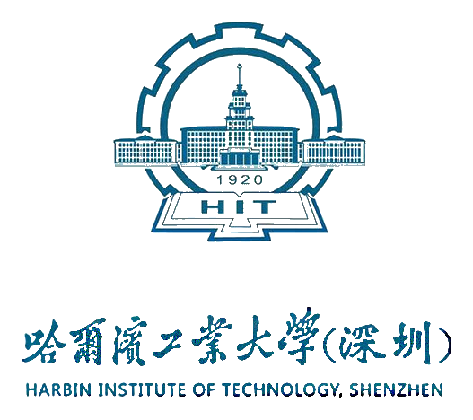
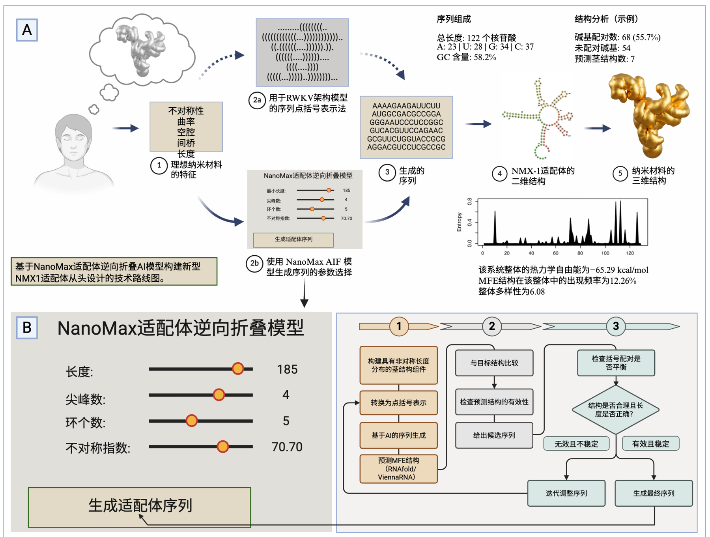
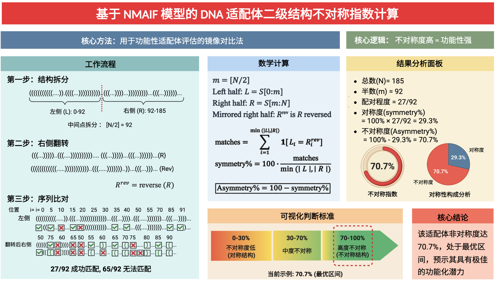
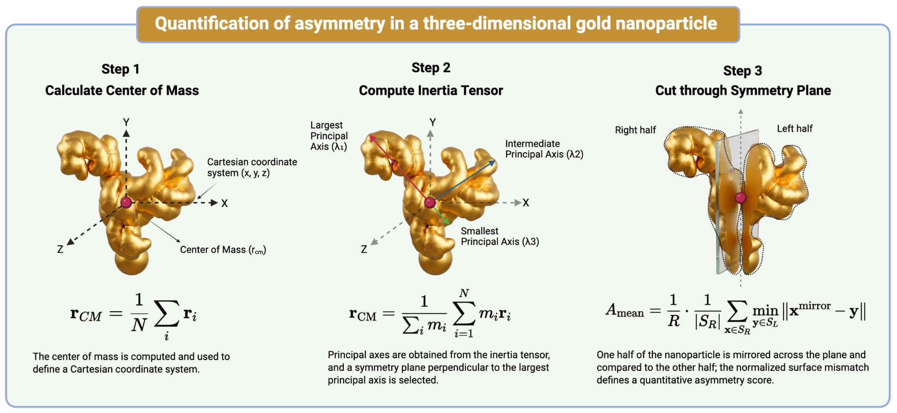

# 🧬 NanoMax Aptamer Inverse Folding Model

<p align="center">
  
</p>

<p align="center">
  <b>Interactive computational inverse design of asymmetric DNA aptamer candidates</b>
</p>

<p align="center">
  <b>A Project by Prof. Xingyi Ma</b><br>
  NanoMax Group, HIT Shenzhen<br><br>
  <b>Design and Developed by Doctor Sukhera (学睿)</b>
</p>

---

## Project overview

NanoMax is a Python-based interactive platform for **asymmetric DNA aptamer inverse design**. The workflow begins with desired structural constraints and generates a candidate DNA sequence for the target asymmetric architecture.

The web prototype allows the user to specify:

- DNA sequence length
- target number of branches
- target number of loops
- GC-content preference
- optional random seed for reproducibility

The generated candidate is then characterized using sequence composition, base-pairing statistics, a secondary-structure asymmetry index, Shannon-entropy sequence diversity, structural descriptors and an internal weighted-pair stability descriptor.

## NanoMax inverse-design workflow

<p align="center">
  
</p>

The project workflow connects desired asymmetric structural features with target secondary-structure generation, candidate sequence generation, structural analysis and downstream nanomaterial-design concepts.

## Secondary-structure asymmetry quantification

<p align="center">
  
</p>

The secondary-structure asymmetry framework uses a mirror comparison of the dot-bracket representation. The structure is divided into two halves, one side is reversed, and positional agreement is compared to derive symmetry and asymmetry percentages.

## Three-dimensional nanomaterial asymmetry concept

<p align="center">
  
</p>

The project also explores a geometric route for quantifying asymmetry in three-dimensional gold nanoparticle morphologies. The conceptual workflow uses the **center of mass**, **inertia tensor/principal axes**, a reference symmetry plane and a mirrored surface-mismatch comparison.

## Core computational approach

**Algorithm:** constraint-guided stochastic inverse design.

**Core technologies:**

- Python
- NumPy probabilistic sampling
- A–T and G–C DNA base-pairing constraints
- dot-bracket secondary-structure representation
- structural-asymmetry scoring
- Shannon entropy for sequence-diversity analysis
- heuristic weighted-pair stability scoring
- Plotly for interactive visualization
- Streamlit for web deployment

### Conceptual flow

```text
Desired asymmetric DNA features
            ↓
Target secondary structure
            ↓
Dot-bracket representation
            ↓
Constrained candidate sequence generation
            ↓
Sequence + structure analysis
            ↓
Candidate for downstream computational / experimental validation
```

## Web interface

On first load, **no candidate sequence or analysis is displayed**. Results appear only after the user selects the design parameters and clicks **Generate DNA aptamer**.

The application includes:

- futuristic dark scientific UI
- HIT Shenzhen branding with transparent logo
- interactive parameter controls
- on-demand candidate generation
- DNA sequence and dot-bracket structure output
- GC content, asymmetry, pairing and stability descriptors
- sequence-composition analysis
- structure-analysis table
- interactive plots
- project overview and scientific-framework figures
- downloadable analysis report

## Repository structure

```text
NanoMax-Aptamer-Designer/
├── app.py
├── nanomax_model.py
├── requirements.txt
├── README.md
├── hitsz-logo-transparent.png
├── nanomax_workflow.png
├── nanomax_asymmetry_index.png
├── nanoparticle_3d_asymmetry.png
└── .streamlit/
    └── config.toml
```

## Run locally

```bash
pip install -r requirements.txt
streamlit run app.py
```

## Deploy on Streamlit Community Cloud

1. Upload all files above to the root of the same GitHub repository.
2. Keep `.streamlit/config.toml` inside the `.streamlit` folder.
3. Set the Streamlit main file to `app.py`.
4. Commit the changes. An existing Streamlit Community Cloud deployment should redeploy from the updated repository.

## Defense-ready description

> **NanoMax uses a constraint-guided stochastic inverse-design algorithm. We first define the desired asymmetric DNA structural characteristics, and the program generates a candidate sequence under base-pairing, GC-content and structural constraints. It then calculates sequence and structural descriptors, including an asymmetry index, to support candidate selection for downstream validation.**

## Research-use note

NanoMax is an interactive computational research prototype. Generated candidate sequences and structural descriptors should be taken forward to established structure-prediction/thermodynamic tools and experimental validation before biological or materials-performance conclusions are drawn.
